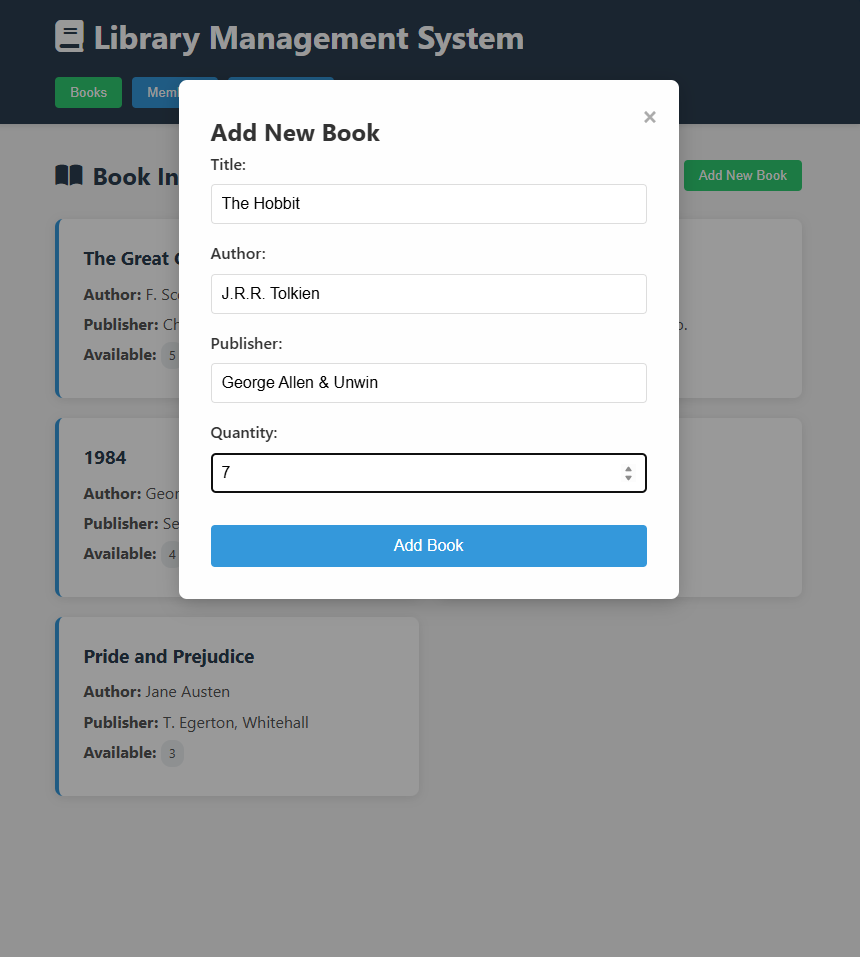
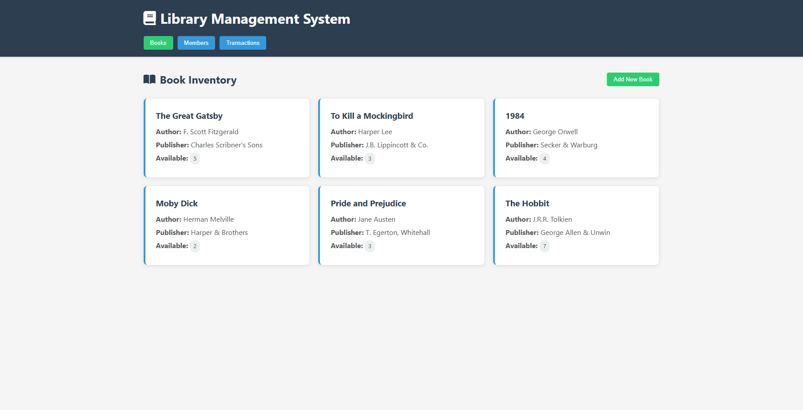
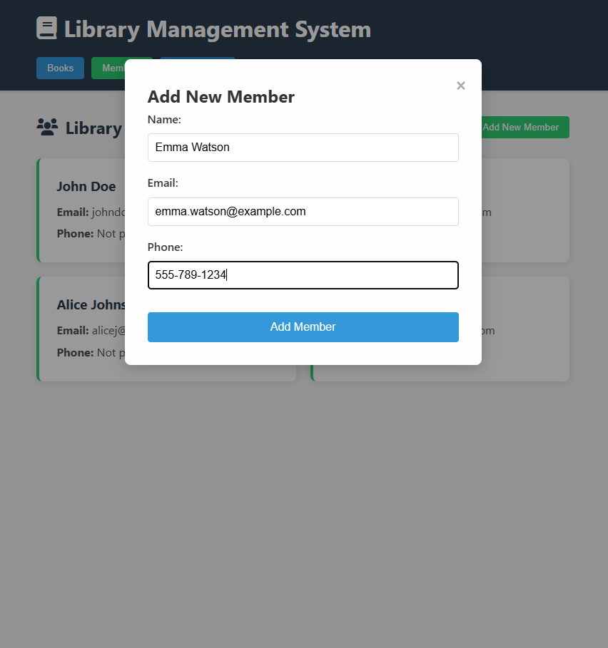
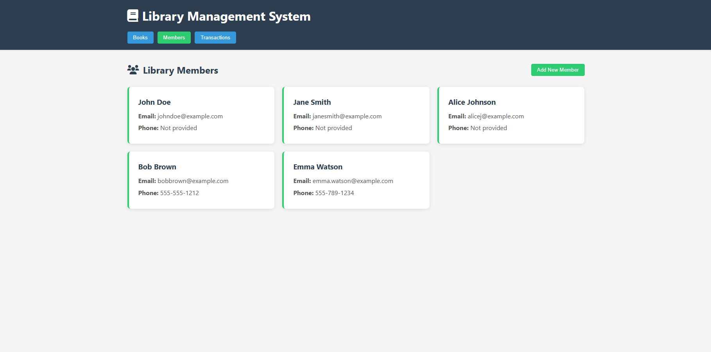
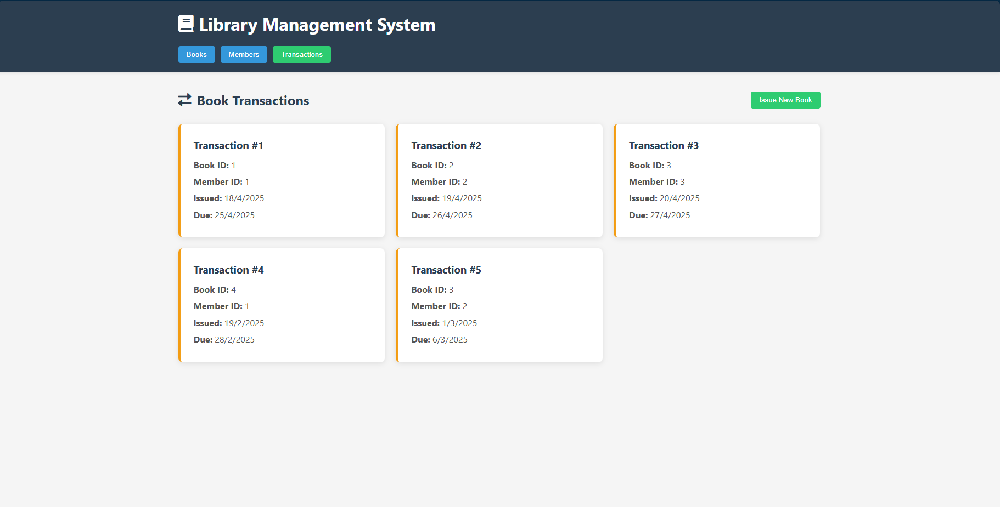
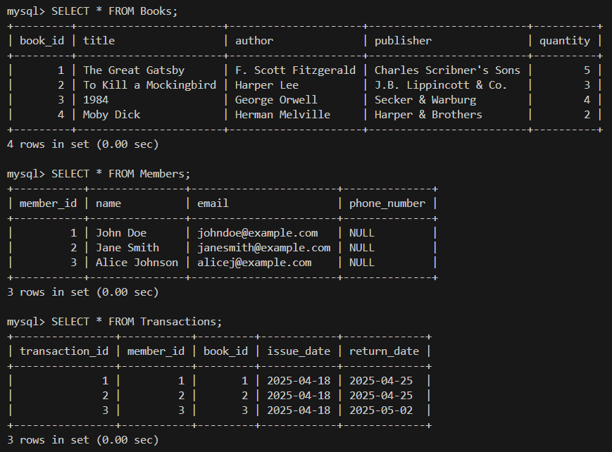

# Library Management System

A complete library management system built with Node.js, Express, MySQL for the backend and HTML/CSS/JavaScript for the frontend.

## ✨ Features

- Book inventory management
- Member registration
- Book issuing and returning
- Responsive design

## 🛠️ Technologies Used

- **Frontend**: HTML5, CSS3, JavaScript
- **Backend**: Node.js, Express
- **Database**: MySQL
- **Version Control**: Git/GitHub

## 📸 Screenshots

| Add Book | Book Section |
|--------------|----------------|
|  |  |

| Add Member | Members Section |
|-------------|----------|
|  |  |

| Issue New Book | Book Transaction Section |
|-------------|----------|
|  |  |

## 🚀 Getting Started

### Prerequisites
- Node.js v18+
- MySQL 8.0+
- Git (optional)

### Installation

1. *Clone the repository:*
   ```bash
   git clone https://github.com/MeenakshiMony/Library_Management_System.git

2. *database setup:*
   These commands are to run in Command prompt/ Powershell
   ```bash
   # Navigate to MySQL bin (if needed)
   cd "C:\Program Files\MySQL\MySQL Server 9.1\bin"

   # Create database and tables
   mysql -u root -p < "D:\Library_Management_System\database\schema.sql"

   # Insert sample data (optional)
   mysql -u root -p library_management < "D:\Library_Management_System\database\seed.sql"

Expected database:

 


3. *Install dependencies:*
   ```bash
   # Navigate to your project root
   cd D:\Library_Management_System

   # Install backend dependencies
   npm install

4. *Start the server:*
   ```bash
   npm run dev

5. *Start frontend:*
   ```bash
   npm run serve-frontend

   
   
   
